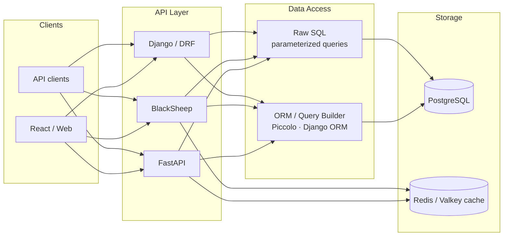
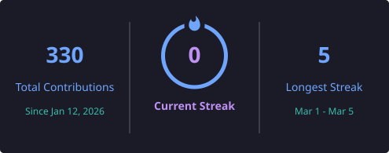

<h1 align="center">Nahim Uddin</h1>
<p align="center">
  <b>Backend Engineer</b> · Python · APIs · Microservices · Bangladesh
</p>

<p align="center">
  <a href="https://nahimportfolio.netlify.app/"></a>
  <a href="mailto:nahim.211902019@gmail.com"></a>
  <a href="https://www.linkedin.com/in/nahimuddin/"></a>
  <a href="https://twitter.com/nahim_uddin_"></a>
</p>

<p align="center">
  
</p>

---

### About

I build **backend systems in Python** — REST APIs, service boundaries, Postgres data models, and Dockerized deployments.

I usually own the path from **API → database → cache/async work**, with clear auth and reliable request flows.

- 🔭 **Building:** FastAPI, BlackSheep, and Django/DRF backends
- 🧩 **Focus:** API design, SQL/Postgres, auth, caching, background jobs
- 🌱 **Exploring:** event-driven services, OIDC / gateway auth, search with Meilisearch
- 💬 **Ask me about:** Python backends, PostgreSQL, FastAPI/BlackSheep, Docker
- 👨‍💻 **Portfolio:** [nahimportfolio.netlify.app](https://nahimportfolio.netlify.app/)
- 📫 **Email:** nahim.211902019@gmail.com
- ⚡ **Fun fact:** when I sit down to practice, music wins more rounds than the skills 😂

---

### System design

How I structure backend work: **APIs → SQL (ORM + raw queries) → Postgres**.



```sql
-- Example: API handler path uses SQL + raw query when needed
-- GET /orders?user_id=42

-- ORM / query builder (simple reads)
SELECT id, status, total
FROM orders
WHERE user_id = 42
ORDER BY created_at DESC;

-- Raw SQL (joins / reporting / performance-sensitive paths)
SELECT o.id, o.status, SUM(oi.qty * oi.price) AS line_total
FROM orders o
JOIN order_items oi ON oi.order_id = o.id
WHERE o.user_id = $1
  AND o.status = 'paid'
GROUP BY o.id, o.status;
```

---

### Featured work

| Project | Stack | What it shows |
|--------|--------|----------------|
| [Clinic Management API](https://github.com/UddinNahim/Clinic-Management-using-fastapi) | FastAPI · Python | Domain APIs, request validation, service structure |
| [E-Commerce Platform](https://github.com/UddinNahim/E-Commerce-Website-) | Django · Python | Full backend flows for catalog, auth, and orders |
| [BlackSheep Learning](https://github.com/UddinNahim/blacksheep-learning) | BlackSheep · Python | Async API patterns with a modern Python framework |
| [Apache Kafka Practice](https://github.com/UddinNahim/Apache-Kafka) | Python · Kafka | Producers/consumers and event-driven basics |
| [Backend Recap](https://github.com/UddinNahim/backend-_development_recape) | Python | Core backend patterns and API practice |
| [DSA Journey](https://github.com/UddinNahim/DSAJourney) | Python | Algorithms and problem-solving practice |

---

### Tech I use

<p align="left">
  
  
  
  
  
  
  
  
  
  
</p>

---

### GitHub stats

<p align="center">
  
  &nbsp;&nbsp;
  
</p>

<p align="center">
  
</p>

<p align="center">
  
</p>

---

### Connect

<p align="left">
  <a href="https://twitter.com/nahim_uddin_" target="blank">
    
  </a>
  <a href="https://www.linkedin.com/in/nahimuddin/" target="blank">
    
  </a>
</p>
