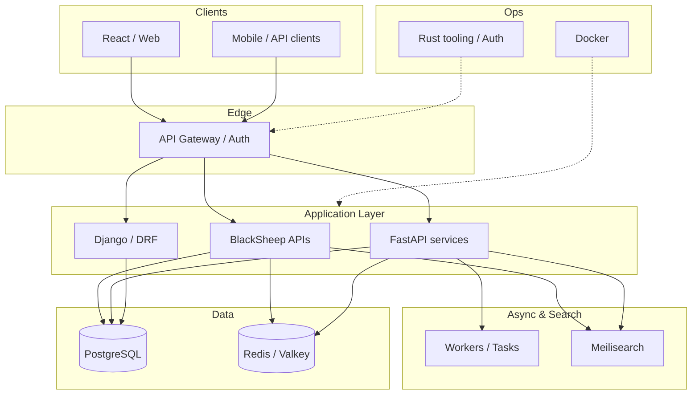

<h1 align="center">Nahim Uddin</h1>

  <b>Backend Engineer</b> · Python · Microservices · Bangladesh

  
  
  
  

  

---

### System design

A sample backend layout with the stack I work with day to day.

---

### About

I design and ship **production backend systems** — APIs, data layers, and service boundaries with Python.

- 🔭 **Working on:** Django, FastAPI, and BlackSheep backends
- 🌱 **Learning:** React, event-driven services, auth / OIDC flows
- 💬 **Ask me about:** Python, SQL, REST APIs, microservice basics
- 👨‍💻 **Portfolio:** [nahimportfolio.netlify.app](https://nahimportfolio.netlify.app/)
- 📫 **Email:** nahim.211902019@gmail.com
- ⚡ **Fun fact:** when I sit down to practice, music wins more rounds than the skills 😂

---

### Tech I use

  
  
  
  
  
  
  
  
  
  

---

### GitHub stats

  
  &nbsp;&nbsp;
  

  

  

---

### Connect

  
  

